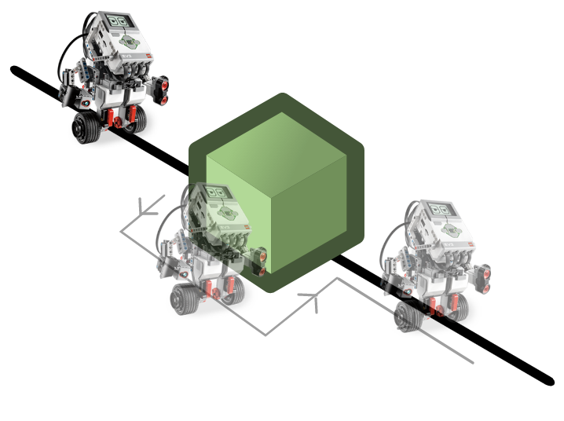
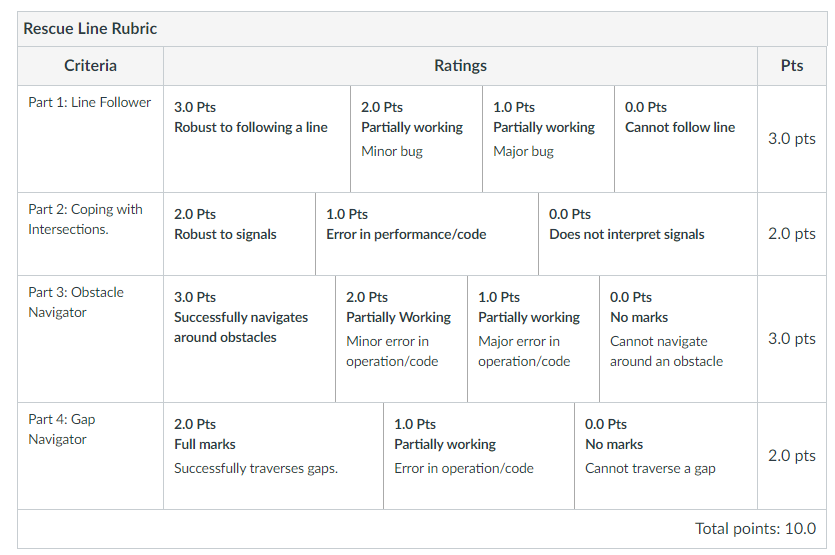

# Artificial-Intelligence-Assignments

## This is the code of Robot Programming - Assignment 1 part. Needs to download LeJOS3 library. Following is the description.

### Assessment
**This exercise is assessed and is worth 10% of your module mark.**

Assessment is by demo and code submission. 

Note that you have already written a lot of the code you need for this assignment as part of previous lab sessions. Therefore you should not have to spend too much time on this exercise. In the past students have spent excessive time on this because they have enjoyed the challenge of thinking up, implementing and testing, interesting solutions. This is fine if you want to do it, but if you have other priorities, please make sure you manage your time wisely.

### Marking

Your marking session will last for up to 10 minutes. The first part will take the form of a discussion between the group and the marker. This discussion should cover the approach taken for the exercise, including design decisions, class structure, testing, evaluation, and anything asked for explicitly in the exercise.

The last 5 minutes will be a demonstration of the robot performing the tasks as required by the exercise. During this presentation, the demonstrator will take notes on the performance of the robot.

###Deadline

Your major deadline is Friday 15th February. The following week, you will have to give a presentation on, and demo, your work. Your whole team must be present for this. Failure to attend a viva means you get 0 marks for the assignment. If you have welfare issues then your absence must be supported by the welfare team.

### Submission

Please submit a text file to Canvas referring to the Git repository URLs where your code is saved. If you haven't used git with eclipse please see the following tutorial (Links to an external site.). (You can get a git repo from https://git.cs.bham.ac.ukLinks to an external site. .

Your submission file must be named ```ex1-<team>.txt```, i.e. if your team is ```a1``` then your file should be ```ex1-a1.txt```, and be plain text (i.e. UTF-8). Each line in the text file should have three things in a fixed order: repository URL, branch, commit hash. These will describe the commit that will be cloned for compilation and testing. For most of you the branch will be ```master``` and the commit should be the last commit hash before you submit (use ```git log``` to find it). If you have used multiple repositories in your solution you should include a line for each in your submission file, listed in the order of their dependencies (i.e. repository from the first line will compile first then included in the classpath for the compilation of code from the repository in the second line etc.). Do not include directories for code provided to you (```rp-shared```, ```rp-pc```, ```rp-utils```) as these will be included in the compilation by default. Please make sure that code in each repository is stored under the directory ```src```.

An example of a submission file, ex1-a1.txt:
```https://git.cs.bham.ac.uk/smithpm/example.git master 768bb37958b8ceb925997d15874ce78d07a50024```

Please also provide Phil and your marker with read access to your repositories. The following list shows the marker name followed by their GitLab then GitHub usernames.

Oliver - oxk312
Michael - cxc1015
Phil - smithpm

### Assignment Overview


This assignment is based upon the RoboCupJunior Rescue Line (Links to an external site.) task. However, we will be only considering a subset of the tasks involved in this challenge in this assignment which focuses on getting your robot to navigate along a line containing some different types of obstacles. The tasks that you have to consider for your robot system that you will be developing are as follows:

#### Part 1 [3 marks]

Build a program that enables your robot to follow a black line on a light background. The line will be 1-2 cm wide. Develop your approach to cope with different lines (straight, curved or a mixture) and try to determine where it breaks. You will be given some sample lines to try your robot on. Make sure your robot works well on a range of lines, and perform quantitative testing on the more challenging ones (e.g. telling us it worked 7 times out of 10).

Code Submission For the code, please include your solutions for the following problems, as described above:

* Follow a line using the colour sensor

#### Part 2 [2 marks]

Develop your robot system from Part 1 to **make a decision on which way to turn at a junction, based upon a set of coloured-tape signals.** An intersection in the path may occur anywhere over the course. Intersection markers will be denoted by ```green tape```, approximately 3cmx3cm in dimension. These are used to indicate the direction of the path that the robot should follow. A piece of ```red``` tape on either side of the line indicates that the course has ended.

1. If there is no green marker, the robot should carry on straight ahead.
2. A dead end may occur where there are two green markers before an intersection, on each side of the line. If this is encountered, your robot should turn around.
3. Intersections are always perpendicular and may have 3 or 4 branches.
4. Intersection markers will be placed just before the intersection.
5. If a red intersection marker is detected on both sides of the line your robot has reached the end of the course and must stop. Only one piece, on one side of the line, does not indicate a stop, and the robot should keep on going.

The below images show possible scenarios:


**Code Submission** For the code submission, please include your solutions for the following problems, as described above:

* A solution encoding a set of rules that indicate which direction a robot should travel at an intersection and when to stop.

#### Part 3 [3 marks]
Develop your robot system from Parts 1 and 2 to **navigate around an obstacle on a path.** Obstacles may consist of bricks, blocks, weights and other large objects. Obstacles will be at least 10cm high. Given the detection of an object, your robot must navigate around this, and join back up to a line, and carry on. Your robot will get no marks if it does anything else, such as pushing an obstacle out of the way. Therefore, please use the appropriate sensor(s) to keep a certain distance from an object.



**Code Submission**
For the code, please include your solutions for the following problems, as described above:

*an extension to your line-following robot system that is able to navigate around an object on a path.

#### Part 4 [2 marks]


Develop your robot system from Parts 1, 2 and 3 to **cope with path-following when there is a gap in the path.** Over the course of the path, your line may end abruptly. This line will start up again a short distance from where it ended, straight ahead from where it ended. Your task is to develop an approach to this problem that is able to cope with variations in gap size. The length of a gap will be no longer than 20cm, and the path will be at least 5cm in length before there is a gap.

**Code Submission**
For the code, please include your solutions for the following problems, as described above:

*an extension to your line-following robot system that is to join back up with a path when it disappears.

#### Extra (Important) Information

You can train your robot on a set of lines that the demonstrators will create for you this week in the lab, but in the viva, your robot will be running on a course that you may or may not have seen before. Therefore, your robot must be robust to all of the tasks above.

Also, during your viva run, your robot will be timed by the demonstrators and this will be recorded and added to a leaderboard. **This does not contribute towards your marks** and is a little bit of fun. You will get a single run that will be recorded, but during this, you can reset your robot if something goes wrong. You will then restart from just before the part of the track that caused the problem with your robot. If your robot does not overcome an obstacle, we will move it to the next part of the track, and the time will be recorded as the maximum possible (a robot has to be able to successfully navigate all the above obstacles autonomously to be in contention to win).

So, focus on getting all the above tasks working robustly before thinking about optimising your code for speed. The team whose robot completes the course in the fastest time will win some tasty food-based reward (:

