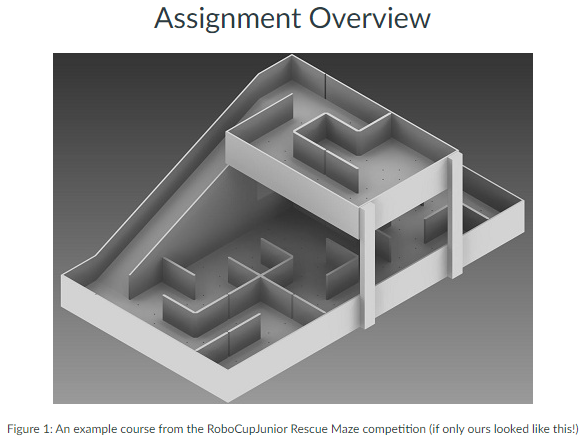
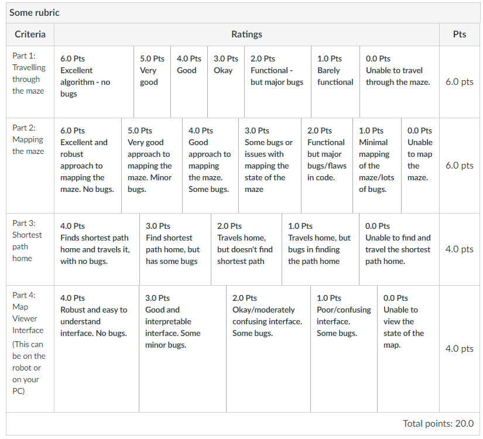

# Artificial-Intelligence-Assignments

## This is the code of Robot Programming - Assignment 1 part. Needs to download LeJOS3 library. Following is the description.

### Assessment
**This exercise is assessed and is worth 20% of your module mark.**

Assessment is by demo and code submission. 

### Deadline
Your major deadline is Friday 22nd March. The following week, you will have to give a presentation on, and demo, your work. Your whole team must be present for this. Failure to attend a viva means you get 0 marks for the assignment. If you have welfare issues then your absence must be supported by the welfare team.



This assignment is based upon the RoboCupJunior Rescue Maze (Links to an external site.) task. However, we will be only considering a subset of the tasks involved in this challenge in this assignment which focuses on getting your robot to navigate through the maze, mapping the maze as it goes along. Your robot does not have to find the fastest path through the maze, instead, it should explore as much of the maze as possible while mapping the environment in the process.

The following information describes the set up of the course:

* The Maze:
  * Walls that make up the maze are ~30cm high (no peeking over!)
  * The width of the path is between ~30cm.
  * Doorways are at least 29cm wide.

* The Floor:
  * The floor can be viewed as a set of 30 x 30cm coloured tiles.
  * Given this, the maze will be 6 tiles long by 9 tiles wide.
  * In between the tiles, there will either be a wall (~10cm thickness) or a ~10cm space to travel across. 
  * Your robot can travel over white tiles.
  * Green tiles in the maze represent "no go" zones that your robot should not cross. Green tiles will be placed randomly throughout the maze.
  * There are black lines on the floor to help the TAs set up the mazes. You should ignore these black lines. Don't use the black lines to help you navigate or map the maze.

* The Path:
  * In the maze, walls that lead to the entrance/exit are called linear walls
  * Walls that do NOT lead to the entrance/exit are called floating walls.
  * The starting tile, the home tile, will be the bottom leftmost tile. Assume this to be as though you were viewing the maze parallel to the widest edge.
  * The robot should start and finish their run at this home tile (a robot has at most 15 minutes for a run, after which time it will have to be stopped to let the next group be marked).
  * The robot will encounter an end tile. This will be red. When this is found, your robot, if it is able to, must travel the shortest path back to the home tile.
  * The maze you encounter in the viva will be one that you haven't encountered before, so do not waste time trying to pre-map the maze before your viva.

The tasks that you have to consider for your robot system that you will be developing are as follows. All of the robot's task should be embedded into a single program that runs on your robot (i.e you must not change the program that your robot is running to adapt to the different tasks):

#### Part 1 [6 marks] - travelling through a maze.

Build a program that enables your robot to travel through a maze to reach an end square. Your robot should be able to navigate the maze without crashing into the walls. You can use the distance sensors or the touch sensors to do so.

A basic robot should follow the walls of a maze. A more sophisticated robot should use a heuristic based approach that overcomes the shortcomings of wall-following maze solvers, such as getting stuck in loops.

If your robot encounters a green square, it must not travel over this.

**Code Submission** For the code, please include your solutions for the following problems, as described above:

* Code that enables your robot to travel through a maze environment without bumping into any walls.
* Code that stops a robot from travel over green tiles.

#### Part 2 [6 marks] - mapping a maze

While your robot is travelling through a maze, it must also be mapping the maze. It must generate a map indicating the location of walls and potential paths from tiles. This must be accurate and reflective of the current state of the maze that the robot is in. In doing this, the robot must keep track of its current location, its heading and a history of its previous locations.

**Code Submission** For the code submission, please include your solutions for the following problems, as described above:

* Code that enables the robot to accurately map and store the state of the maze.
* Code that stores the current location of the robot and a history of its previous locations in the maze. 

#### Part 3 [4 marks] - travelling the shortest path home

Your robot will eventually find an end marker in the maze. This will be a red piece of paper. From this, your robot should determine and travel the shortest path from the end square to the home square. The shortest path is defined as the path from the end square to the home square that covers the least possible number of squares to be travelled.

N.B If your robot has not mapped the whole maze yet, it may not know the shortest path. In this case, your robot should carry on mapping the maze until such a point that it is confident about the shortest path. At this time, it should travel back to the end square, then back to the home square, following the shortest path.

**Code Submission**
For the code, please include your solutions for the following problems, as described above:

* Code that generates the shortest path from the end square to the home square.
* Code that decides if the robot has discovered enough of the maze to make the decision regarding whether the shortest path can be determined.

#### Part 4 [4 marks] - Viewing the map
Develop a way to view the current state of the map that the robot is generating. At a minimum, an occupancy grid should be displayed on your robot's LCD display. Preferably, your robot should remotely communicate with a client running on a lab machine or your laptop that should update a GUI containing an occupancy grid in real-time in response to the robot's movements and its view of the maze. 

**Code Submission**
For the code, please include your solutions for the following problems, as described above:

* Code that displays an occupancy grid on your robot's LCD screen.
* Code that displays an occupancy grid on a PC that is remotely connected to your robot.

#### Extra (Important) Information

**In the viva, your robot will be running on a course that you may or may not have seen before.** Therefore, your robot must be robust to all of the tasks above.

Also, during your viva run, your robot will be timed by the demonstrators and this will be recorded and added to a leaderboard. **This does not contribute towards your marks** and is a little bit of fun. You will get a single run that will be recorded, but during this, you can reset your robot if something goes wrong. You will then restart from just before the part of the maze that caused the problem with your robot. If your robot does not overcome an obstacle, we will move it to the next part of the track, and the time will be recorded as the maximum possible (a robot has to be able to successfully navigate all the above obstacles autonomously to be in contention to win).

So, focus on getting all the above tasks working robustly before thinking about optimising your code for speed. The team whose robot completes the course in the fastest time will win some tasty food-based reward (:

#### Marking

Your marking session will last for up to 15 minutes. For this, you will set up and let your robot run through the course. The robot should be running the code that you submitted prior to the deadline. Please ensure that you arrive early to check that your code is on the robot, and the **battery of your robot is fully charged.**

During the viva, your marker will discuss with you certain aspects of your program such as design decisions, class structure, testing, evaluation, and anything asked for explicitly in the exercise. Your marker will take notes while you are discussing this to give you feedback after the viva.

**Submission**

Please submit a text file to Canvas referring to the Git repository URLs where your code is saved. If you haven't used git with eclipse please see the following tutorial (Links to an external site.)Links to an external site.. (You can get a git repo from https://git.cs.bham.ac.uk to an external site.

Your submission file must be named ```ex2-<team>.txt```, i.e. if your team is ```a1``` then your file should be ```ex2-a1.txt```, and be plain text (i.e. UTF-8). Each line in the text file should have three things in a fixed order: repository URL, branch, commit hash. These will describe the commit that will be cloned for compilation and testing. For most of you the branch will be ```master``` and the commit should be the last commit hash before you submit (use ```git log``` to find it). If you have used multiple repositories in your solution you should include a line for each in your submission file, listed in the order of their dependencies (i.e. repository from the first line will compile first then included in the classpath for the compilation of code from the repository in the second line etc.) Please make sure that code in each repository is stored under the directory ```src```.

An example of a submission file, ex2-a1.txt:
```https://git.cs.bham.ac.uk/smithpm/example.git master 768bb37958b8ceb925997d15874ce78d07a50024```

Please also provide Phil and your marker with read access to your repositories. The following list shows the marker name followed by their GitLab then GitHub usernames.

* Oliver - oxk312
* Michael - cxc1015
* Xunzhao - XXY653
* Phil - smithpm

