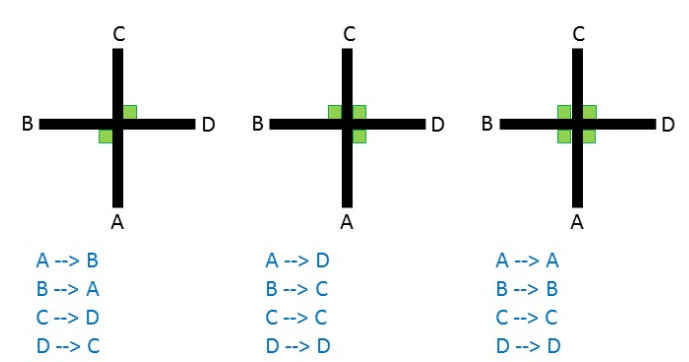

# Artificial Intelligence Assignments 2
## Assignment Description
This assignment will be graded out of 50 and will contribute towards 10% of this module's continuous assessment. 

This assignment consists of 3 (three) questions and you are required to submit two java programs and one pdf file. This assignment only allows for the submission of files with extensions .java and .pdf. 

If you choose to write your solutions out then you must ensure that you write legibly and that any pictures you take of your written work are clear and of a reasonable resolution. Ensure that you maintain the aspect ratio of any images you use. 

Each question has a list of criteria which will be used for grading and this is listed at the end of that question. Carefully read through this before you start working on this assignment. 

Be sure to double check the deadline for this assignment - extensions will be possible ONLY through welfare. Please remember that a delay in submission will lead to a significant delay in grading as we enter the Easter holidays. 

Your assignment begins below.

### Question 1     [ 15 Marks ]
Recall the Java program discussed in class for Univariate Linear Regression (https://github.com/alfi-s/univariate-linear-regression (Links to an external site.)) 

Write a program to perform Univariate non-linear Regression and test it on the following data where x is the independent variable and y the dependant variable.

Assume that the this hypothesis function is quadratic - this will imply that the hypothesis function is of the form:

hw( x ) = w0 + w1x + w2x2

Run your program through as many epochs as is required before you achieve a reasonable fit. Remember that extremely high values of the learning rate will result in your program not converging. Here are some suggested initial values: w0  = w1 = w2 = 0 and alpha = 0.0001

<u>**You are required to submit the following:**</u>

Your java code (as a file named solution1.java) 

Your pdf containing your write up must include the final values of w0, w1 and w2 along with a plot of the above points and a plot of the curve you have "fit" to this data. An easy way of plotting this is to use a spreadsheet, enter in the training data and to add a column that makes use of a formula to generate values of y. This formula will be your hypothesis function parameterized by w. You are, of course, free to include code to generate this chart within your java program. 

I will discuss details on how to create this chart in class. You are encouraged to start writing the java code before then. 

&nbsp;
<u>**Grading Criteria:**</u>

Your java code will be evaluated primarily on correctness and clarity, while some weight will be placed on a reasonable number of comments. 

Your write-up will be graded on how accurately your parameterized hypothesis function fits the training data. Any reasonable fit will be accepted. 

Below is an example of what is expected: 

### Question 2     [ 25 Marks ]

Write a program to perform Multivariate Logistic Regression and test it on the following data where x1 and x2 are independent variables and y represents whether or not that input belongs to the class (y=1) or not (y=0)

Recall that the hypothesis function of logistic regression with two independent variables is of the form:

hw( x ) = g(w0 + w1x1 + w2x2)

As in Question 1, run your program through as many epochs as is required before you achieve a reasonable fit. Here are some suggested initial values: w0  = w1 = w2 = 0 and alpha = 0.1

<u>**You are required to submit the following:**</u>

Your java code (as a file named solution2.java) 

Your pdf containing your write up must include the final values of w0, w1 and w2 along with a plot of the above points and a plot of the decision boundary. Note that this chart will be x1 vs x2 and the decision boundary can be calculated using x2 = ( - w1*x1 - w0 ) / w2. Once again, feel free to use a spreadsheet to plot this, alternatively include the plots in your program code. 

<u>**Grading Criteria:**</u>

Your java code will be evaluated primarily on correctness and clarity, while some weight will be placed on a reasonable number of comments. 

Your write-up will be graded on how accurately your parameterized hypothesis function fits the training data. Any reasonable fit will be accepted. 

Below is an example of what is expected: 

### Question 3  [10 Marks ]

Recall the diagram representing a single logistic unit capable of performing the AND operation on two variables discussed during the lecturers. 

Draw a single logistic unit capable of performing the AND operation on THREE variables. Include a table showing the values of x1, x2, x3, z and g(z). Notice that this table will have eight rows. [5 marks]

Draw a single logistic unit capable of performing the OR operation on THREE variables. Include a table showing the values of x1, x2, x3, z and g(z). Notice that this table will have eight rows. [5 marks]

<u>**Grading Criteria:**</u>

Your solution will be graded on correctness of the weights and the correct illustration of the logit.

You will additionally be evaluated on the table you provide detailing the values of z and g(z) for all possible values of x1, x2 and x3. 

End of assignment.